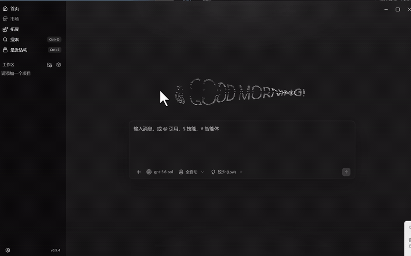

# 首页外观与粒子字标

打开「设置 → 基础设置 → 外观」，在「首页外观」中修改标题、字体、Logo 和粒子设置。首页只展示结果，不提供编辑表单。

- 标题最多 80 个字符；留空使用当前界面语言的默认标题。
- 字体可选系统、衬线、等宽。Logo 支持本地 PNG/JPEG/WebP，最大 512 KB、2048 × 2048；不设置时显示当前引擎图标。
- 粒子模式为开启、跟随系统、关闭，默认跟随系统。明确开启会播放鼠标扰动与回弹；跟随系统在减少动态效果生效时暂停，并在设置中说明原因。
- 粒子密度有三档，配色可跟随主题或自定义。

修改后点击「保存」生效；「取消修改」恢复已保存内容。「恢复默认」先更新草稿，再点击保存确认。离开外观页不会自动保存草稿。

配置通过现有 clientStorage 保存到 app store 的 `home.wordmarkAppearance`。图片作为本地 data URL 存储，不上传服务器。损坏配置使用安全默认值；Canvas 失败或关闭时回到普通标题与 Logo，保留标题的可访问语义。

## 演示

[查看原始 MP4 演示（约 18 秒）](media/home-appearance-demo.mp4)

视频由贡献者提供，展示 Windows v0.9.4 自建客户端中的首页粒子交互、设置入口、标题编辑与保存后生效。它不覆盖重启持久化、Logo 上传、所有播放模式或其他平台。GIF 是同一段视频的低分辨率预览；MP4 保留原文件。

## 实现与来源

实现集中在 `src/features/home/`，设置表单由 `BasicAppearanceSection` 引入。状态及低频更新通知由 home feature 持有，不向 AppShell domain bag 增加状态。

Canvas 核心适配自 [First Light](https://github.com/Moyf/first-light)，MIT notice 同时保留在 `src/features/home/particle/LICENSE.first-light` 与 `public/licenses/first-light.txt`，后者随前端资源分发。

中英文、繁体中文提供完整新文案，其余已发布 locale bundle 新增相同键并暂用英文；不修改原有翻译。

验证范围和未完成项见 [OpenSpec verification](../../../openspec/changes/add-home-appearance-and-particles/verification.md)。
